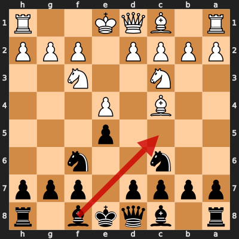
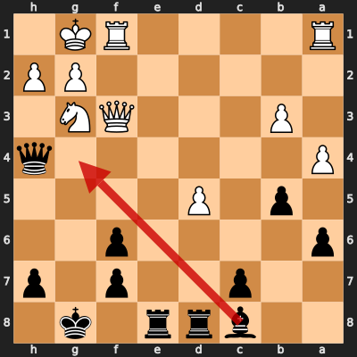
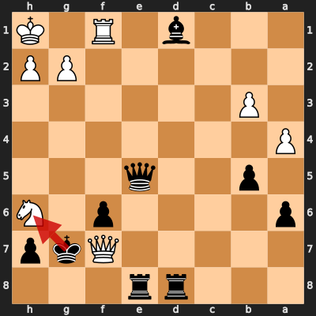
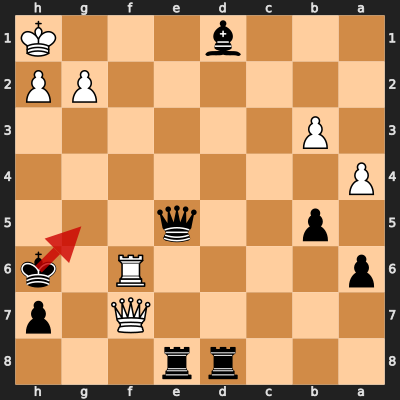

# Game 10: RdHdRdmptn vs diegoami

| | |
|---|---|
| Date | 2024.08.26 |
| Result | 1-0 |
| White | RdHdRdmptn (1645) |
| Black | diegoami (1572) |
| Opening | C47 |
| Time control | 1/86400 |
| Termination | RdHdRdmptn won by checkmate |
| Source | [Chess.com](https://www.chess.com/game/daily/695253865) |

[Download PGN](10/10.pgn)

## Opening theory

**Opening moves**: 1. e4 e5 2. Nf3 Nc6 3. Bc4 Nf6 4. Nc3



Matches a cataloged line (*Four Knights Game: Italian Variation*, ECO C47) through 4. Nc3. diegoami played 4... Bc5, the first move not found in any named line in this dataset.

**Known continuations from here:**

- 4... Nxe4 5. Bxf7+ (*Four Knights Game: Italian Variation, Noa Gambit*, C47)

## Blunders by diegoami

### Move 22... Bg4 (Mistake)

**Moves from the start of the game**: 1. e4 e5 2. Nf3 Nc6 3. Bc4 Nf6 4. Nc3 Bc5 5. O-O O-O 6. b3 a6 7. Bb2 b5 8. Bd5 Bb7 9. Bxc6 dxc6 10. Nxe5 Re8 11. Ne2 Nxe4 12. d4 Bd6 13. f4 Qh4 14. Qd3 Nf6 15. c4 Rad8 16. a4 Bxe5 17. fxe5 Rxe5 18. d5 Ree8 19. Bxf6 gxf6 20. Ng3 Bc8 21. Qf3 cxd5 22. cxd5

**Better was:** 22... Qd4+ 23. Kh1 Re3 24. Qh5 Rxg3 25. hxg3 Bg4 26. Qh2 ∓

**Best continuation:** 23. Qf4 Qg5 ±



### Move 30... Kxh6 (Blunder)

**Moves since the previous diagram**: 22... Bg4 23. Qf4 Qg5 24. Qxc7 Qxd5 25. Rf4 Bd1 26. Rf1 Qd4+ 27. Kh1 Qxa1 28. Nf5 Qe5 29. Nh6+ Kg7 30. Qxf7+

**Better was:** 30... Kh8 31. h3 Rf8 32. Qa7 Bh5 33. Nf5 Rg8 34. Nh6 -+

**Best continuation:** 31. Rxf6+ Qxf6 32. Qxf6+ Kh5 33. Qf5+ Kh6 =



### Move 31... Kg5 (Blunder)

**Moves since the previous diagram**: 30... Kxh6 31. Rxf6+

**Better was:** 31... Qxf6 32. Qxf6+ Kh5 33. Qf5+ Kh6 =

**Best continuation:** 32. Qg7+ Kh4 33. Qh6+ Kg4 34. h3+ Kg3 35. Qg7+ Kh4 +-



## Full PGN

<details>
<summary>Show movetext</summary>

```pgn
[Event "Let\\'s Play!"]
[Site "Chess.com"]
[Date "2024.08.26"]
[Round "?"]
[White "RdHdRdmptn"]
[Black "diegoami"]
[Result "1-0"]
[TimeControl "1/86400"]
[WhiteElo "1645"]
[BlackElo "1572"]
[Termination "RdHdRdmptn won by checkmate"]
[ECO "C47"]
[EndDate "2024.09.02"]
[Link "https://www.chess.com/game/daily/695253865"]

1. e4 { +0.31 } 1... e5 { +0.33 } 2. Nf3 { +0.35 } 2... Nc6 { +0.26 } 3. Bc4
{ +0.18 } 3... Nf6 { +0.12 } 4. Nc3 { -0.10 } 4... Bc5 { +0.14 } 5. O-O
{ +0.11 } 5... O-O { +0.14 } 6. b3 { -0.63 } 6... a6 { -0.50 } 7. Bb2 { -0.72 }
7... b5 { +0.04 } 8. Bd5 { +0.12 } 8... Bb7 { +0.37 } 9. Bxc6 { +0.36 } 9...
dxc6 { +0.25 } 10. Nxe5 { +0.05 } 10... Re8 { -0.01 } 11. Ne2 { -0.46 } 11...
Nxe4 { -0.52 } 12. d4 { -0.47 } 12... Bd6 { -0.42 } 13. f4 $6 { -2.02 } ( 13.
Ng3 c5 $15 ) 13... Qh4 { -0.92 } ( 13... f6 14. Qd3 c5 15. d5 fxe5 16. Qxe4
exf4 17. Qf3 $17 ) 14. Qd3 { -0.16 } 14... Nf6 { +0.00 } 15. c4 { +0.00 } 15...
Rad8 { +0.35 } 16. a4 { -0.50 } 16... Bxe5 { -0.14 } 17. fxe5 { -0.09 } 17...
Rxe5 { +0.38 } 18. d5 { +0.20 } 18... Ree8 { +0.11 } 19. Bxf6 { +0.26 } 19...
gxf6 { +0.19 } 20. Ng3 { -0.51 } 20... Bc8 { -0.03 } 21. Qf3 { -0.23 } 21...
cxd5 { +0.00 } 22. cxd5 $6 { -1.12 } ( 22. Nh5 Re5 23. Nxf6+ Kh8 24. Nxd5 Qd4+
25. Kh1 Rf5 $10 ) 22... Bg4 $2 { +1.35 } ( 22... Qd4+ 23. Kh1 Re3 24. Qh5 Rxg3
25. hxg3 Bg4 26. Qh2 $17 ) ( 22... Qd4+ 23. Kh1 Re3 24. Qh5 Rxg3 25. hxg3 Bg4
26. Qh2 $17 ) 23. Qf4 { +1.17 } ( 23. Qf4 Qg5 $16 ) 23... Qg5 { +1.18 } 24.
Qxc7 $6 { -0.28 } ( 24. Ne4 Rxe4 $16 ) 24... Qxd5 { -0.06 } ( 24... Rxd5 25.
axb5 $10 ) 25. Rf4 { -0.60 } 25... Bd1 { -0.59 } 26. Rf1 $4 { -5.14 } ( 26. Qc3
$15 ) 26... Qd4+ { -5.42 } ( 26... Qd4+ 27. Kh1 Qxa1 28. axb5 Qe5 29. Qxe5 fxe5
30. bxa6 $19 ) 27. Kh1 { -5.41 } 27... Qxa1 { -5.32 } 28. Nf5 { -5.62 } 28...
Qe5 { -5.35 } 29. Nh6+ { -5.27 } 29... Kg7 { -5.53 } 30. Qxf7+ { -5.75 } 30...
Kxh6 $4 { +0.00 } ( 30... Kh8 31. h3 Rf8 32. Qa7 Bh5 33. Nf5 Rg8 34. Nh6 $19 )
31. Rxf6+ { +0.00 } ( 31. Rxf6+ Qxf6 32. Qxf6+ Kh5 33. Qf5+ Kh6 $10 ) 31... Kg5
$4 { +999.92 } ( 31... Qxf6 32. Qxf6+ Kh5 33. Qf5+ Kh6 $10 ) 32. Qg7+
{ +999.93 } ( 32. Qg7+ Kh4 33. Qh6+ Kg4 34. h3+ Kg3 35. Qg7+ Kh4 $18 ) 32...
Kh4 { +999.93 } 33. Qh6+ { +999.94 } 33... Bh5 { +999.94 } 34. Rf4+ { +999.95 }
34... Qxf4 { +999.95 } 35. Qxf4+ { +999.96 } 35... Bg4 { +999.96 } 36. Qh6+
{ +999.97 } 36... Bh5 { +999.97 } 37. g3+ { +999.98 } 37... Kg4 { +999.98 } 38.
Qf4+ { +999.99 } 38... Kh3 { +999.99 } 39. Qh4# { +1000.00 } 1-0
```
</details>
