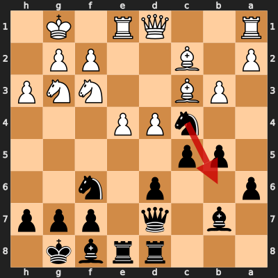
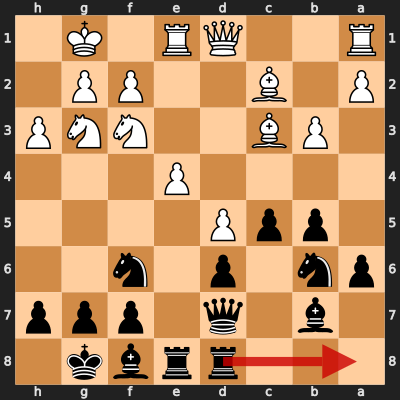

# Game 2: petrit68 vs diegoami

| | |
|---|---|
| Date | 2024.10.02 |
| Result | 1-0 |
| White | petrit68 (1678) |
| Black | diegoami (1602) |
| Opening | C77 |
| Time control | 1/86400 |
| Termination | petrit68 won by resignation |
| Source | [Chess.com](https://www.chess.com/analysis/collection/analyzed-games-GfNkLXga/3zPfMHgX26/games) |

[Download PGN](2/2.pgn)

## Opening theory

**Opening moves**: 1. e4 e5 2. Nf3 Nc6 3. Bb5 a6 4. Ba4 Nf6 5. O-O d6


Matches a cataloged line (*Ruy Lopez: Morphy Defense, Steinitz Deferred*, ECO C79) through 5... d6. petrit68 played 6. Re1, the first move not found in any named line in this dataset.

**Known continuations from here:**

- 6. Bxc6+ bxc6 7. d4 Nxe4 (*Ruy Lopez: Morphy Defense, Steinitz Deferred*, C79)

## Blunders by diegoami

### Move 15... Rad8 (Mistake)

**Moves from the start of the game**: 1. e4 e5 2. Nf3 Nc6 3. Bb5 a6 4. Ba4 Nf6 5. O-O d6 6. Re1 Be7 7. c3 O-O 8. h3 b5 9. Bb3 Bb7 10. d4 exd4 11. cxd4 Na5 12. Bc2 Qd7 13. Nbd2 Rfe8 14. Nf1 Bf8 15. Ng3

**Better was:** 15... c5 16. d5 ±

**Best continuation:** 16. Bg5 Be7 17. Nf5 Nc6 18. Rc1 Kh8 19. d5 Ne5 ±


### Move 18... Nb6 (Mistake)

**Moves since the previous diagram**: 15... Rad8 16. Bd2 Nc4 17. Bc3 c5 18. b3

**Better was:** 18... cxd4 19. Nxd4 Ne5 20. f4 Ng6 21. Qf3 d5 22. e5 +=

**Best continuation:** 19. d5 Nbxd5 20. exd5 Nxd5 21. Ba5 Rxe1+ 22. Qxe1 Re8 ±



### Move 19... Ra8 (Mistake)

**Moves since the previous diagram**: 18... Nb6 19. d5

**Better was:** 19... Nbxd5 20. exd5 Rxe1+ 21. Nxe1 Nxd5 22. Bb2 Re8 23. Nf3 ±

**Best continuation:** 20. Bxf6 gxf6 21. Nh4 Bc8 22. Ngf5 Kh8 23. Re3 c4 +-



### Move 21... a5 (Mistake)

**Moves since the previous diagram**: 19... Ra8 20. Ba5 Nc8 21. Bc3

**Better was:** 21... Qd8 22. Qd2 g6 23. Rad1 b4 24. Ba1 Bg7 25. h4 ±

**Best continuation:** 22. Bxf6 gxf6 23. Nh4 Ne7 24. Nh5 Bg7 25. Qd3 Kf8 +-


### Move 22... a4 (Mistake)

**Moves since the previous diagram**: 21... a5 22. Qd2

**Better was:** 22... Qd8 23. Qd3 ±

**Best continuation:** 23. Bxf6 gxf6 24. bxa4 b4 25. Nh2 Kh8 26. a3 b3 +-


### Move 26... f5 (Blunder)

**Moves since the previous diagram**: 22... a4 23. bxa4 bxa4 24. Bxf6 gxf6 25. Nh5 Bg7 26. Qf4

**Better was:** 26... Ne7 27. Qxf6 +-

**Best continuation:** 27. Qg5 f6 28. Nxf6+ Kh8 29. Nxd7 Bxa1 30. Rxa1 Rg8 +-


## Full PGN

<details>
<summary>Show movetext</summary>

```pgn
[Event "Let's Play!"]
[Site "Chess.com"]
[Date "2024.10.02"]
[Round "-"]
[White "petrit68"]
[Black "diegoami"]
[Result "1-0"]
[WhiteElo "1678"]
[BlackElo "1602"]
[ECO "C77"]
[Termination "petrit68 won by resignation"]
[TimeControl "1/86400"]
[EndTime "14:16:26"]
[EndDate "2024.10.26"]
[Link "https://www.chess.com/analysis/collection/analyzed-games-GfNkLXga/3zPfMHgX26/games"]

1. e4 { +0.32 } 1... e5 { +0.44 } 2. Nf3 { +0.43 } 2... Nc6 { +0.41 } 3. Bb5
{ +0.37 } 3... a6 { +0.43 } 4. Ba4 { +0.47 } 4... Nf6 { +0.31 } 5. O-O
{ +0.42 } 5... d6 { +0.50 } 6. Re1 { +0.53 } 6... Be7 { +0.53 } 7. c3 { +0.58 }
7... O-O { +0.55 } 8. h3 { +0.57 } 8... b5 { +0.52 } 9. Bb3 { +0.54 } 9... Bb7
{ +0.41 } 10. d4 { +0.40 } 10... exd4 { +0.86 } 11. cxd4 { +0.90 } 11... Na5
{ +0.82 } 12. Bc2 { +0.80 } 12... Qd7 { +1.16 } 13. Nbd2 { +1.26 } 13... Rfe8
{ +1.35 } 14. Nf1 { +1.02 } 14... Bf8 $6 { +1.57 } ( 14... d5 $16 ) 15. Ng3
{ +1.57 } ( 15. Ng3 c5 16. d5 Nc4 17. b3 Nb6 18. Bb2 Qd8 $16 ) 15... Rad8 $2
{ +2.74 } ( 15... c5 16. d5 $16 ) 16. Bd2 { +2.26 } ( 16. Bg5 Be7 17. Nf5 Nc6
18. Rc1 Kh8 19. d5 Ne5 $16 ) 16... Nc4 { +2.33 } 17. Bc3 $2 { +1.23 } ( 17. Bg5
Be7 18. Qc1 c5 19. b3 Nb6 20. Qf4 Qc7 $16 ) 17... c5 $6 { +1.79 } ( 17... d5
18. e5 Ne4 19. Nxe4 dxe4 20. Bxe4 c5 21. b3 $16 ) ( 17... d5 18. e5 Ne4 19.
Nxe4 dxe4 20. Bxe4 c5 21. b3 $16 ) 18. b3 $2 { +0.57 } ( 18. d5 Ne5 19. Nh2 b4
20. Bd2 Qc7 21. Bg5 Be7 $16 ) ( 18. d5 Ne5 19. Nh2 b4 20. Bd2 Qc7 21. Bg5 Be7
$16 ) 18... Nb6 $2 { +2.50 } ( 18... cxd4 19. Nxd4 Ne5 20. f4 Ng6 21. Qf3 d5
22. e5 $14 ) ( 18... cxd4 19. Nxd4 Ne5 20. f4 Ng6 21. Qf3 d5 22. e5 $14 ) 19.
d5 { +2.63 } ( 19. d5 Nbxd5 20. exd5 Nxd5 21. Ba5 Rxe1+ 22. Qxe1 Re8 $16 )
19... Ra8 $2 { +4.20 } ( 19... Nbxd5 20. exd5 Rxe1+ 21. Nxe1 Nxd5 22. Bb2 Re8
23. Nf3 $16 ) 20. Ba5 $2 { +1.33 } ( 20. Bxf6 gxf6 21. Nh4 Bc8 22. Ngf5 Kh8 23.
Re3 c4 $18 ) ( 20. Bxf6 gxf6 21. Nh4 Bc8 22. Ngf5 Kh8 23. Re3 c4 $18 ) 20...
Nc8 $6 { +1.85 } ( 20... Qd8 21. Qd2 g6 22. Nh2 Bg7 23. Rad1 Nfd7 24. a3 $16 )
( 20... Qd8 21. Qd2 g6 22. Nh2 Bg7 23. Rad1 Nfd7 24. a3 $16 ) 21. Bc3 { +1.54 }
( 21. Qd2 g6 22. a3 Qe7 23. Ng5 h6 24. Nf3 Bg7 $16 ) 21... a5 $2 { +4.10 } (
21... Qd8 22. Qd2 g6 23. Rad1 b4 24. Ba1 Bg7 25. h4 $16 ) 22. Qd2 $2 { +2.42 }
( 22. Bxf6 gxf6 23. Nh4 Ne7 24. Nh5 Bg7 25. Qd3 Kf8 $18 ) ( 22. Bxf6 gxf6 23.
Nh4 Ne7 24. Nh5 Bg7 25. Qd3 Kf8 $18 ) 22... a4 $2 { +4.27 } ( 22... Qd8 23. Qd3
$16 ) ( 22... Qd8 23. Qd3 $16 ) 23. bxa4 { +4.63 } ( 23. Bxf6 gxf6 24. bxa4 b4
25. Nh2 Kh8 26. a3 b3 $18 ) 23... bxa4 { +4.61 } 24. Bxf6 { +4.81 } 24... gxf6
{ +4.89 } 25. Nh5 { +4.73 } 25... Bg7 $6 { +5.38 } 26. Qf4 { +4.94 } ( 26. Nh2
Re5 27. Nxg7 Kxg7 28. Ng4 Rh5 29. Qc3 Qd8 $18 ) 26... f5 $4 { +9.71 } ( 26...
Ne7 27. Qxf6 $18 ) 27. Qg5 { +9.75 } ( 27. Qg5 f6 28. Nxf6+ Kh8 29. Nxd7 Bxa1
30. Rxa1 Rg8 $18 ) 1-0
```
</details>
