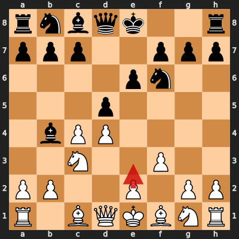

# Game 3: diegoami vs Unexpectedfriend10

| | |
|---|---|
| Date | 2024.09.30 |
| Result | 1/2-1/2 |
| White | diegoami (1608) |
| Black | Unexpectedfriend10 (1873) |
| Opening | E20 |
| Time control | 1/86400 |
| Termination | Game drawn by agreement |
| Source | [Chess.com](https://www.chess.com/game/daily/709946387?move=0) |

[Download PGN](3/3.pgn)

## Opening theory

**Opening moves**: 1. d4 Nf6 2. c4 e6 3. Nc3 Bb4 4. f3 d5



Matches a cataloged line (*Nimzo-Indian Defense: Kmoch Variation*, ECO E20) through 4... d5. diegoami played 5. e3, the first move not found in any named line in this dataset.

**Known continuations from here:**

- 5. a3 Bxc3+ 6. bxc3 c5 7. cxd5 (*Nimzo-Indian Defense: Sämisch Variation*, E25)

## Blunders by diegoami

No blunders (Mistake or worse) by diegoami found in this game.

## Full PGN

<details>
<summary>Show movetext</summary>

```pgn
[Event "Let\\'s Play!"]
[Site "Chess.com"]
[Date "2024.09.30"]
[Round "?"]
[White "diegoami"]
[Black "Unexpectedfriend10"]
[Result "1/2-1/2"]
[TimeControl "1/86400"]
[WhiteElo "1608"]
[BlackElo "1873"]
[Termination "Game drawn by agreement"]
[ECO "E20"]
[EndDate "2024.12.03"]
[Link "https://www.chess.com/game/daily/709946387?move=0"]

1. d4 { +0.32 } 1... Nf6 { +0.30 } 2. c4 { +0.26 } 2... e6 { +0.28 } 3. Nc3
{ +0.19 } 3... Bb4 { +0.15 } 4. f3 { +0.03 } 4... d5 { +0.07 } 5. e3 { -0.29 }
5... c6 { +0.17 } 6. Bd3 { +0.05 } 6... c5 { +0.03 } 7. Ne2 { -0.07 } 7... dxc4
{ +0.06 } 8. Bxc4 { +0.17 } 8... Nc6 { +0.56 } 9. a3 { +0.48 } 9... Bxc3+
{ +0.43 } 10. bxc3 { +0.57 } 10... cxd4 { +0.65 } 11. cxd4 { +0.69 } 11... O-O
{ +0.69 } 12. O-O { +0.81 } 12... e5 { +1.11 } 13. dxe5 { +0.33 } 13... Qxd1
{ +0.54 } 14. Rxd1 { +0.60 } 14... Nxe5 { +0.57 } 15. Bb3 { +0.58 } 15... Re8
{ +1.17 } 16. e4 { +0.94 } 16... Be6 { +0.94 } 17. Bxe6 { +0.91 } 17... Rxe6
{ +0.92 } 18. Bb2 { +0.84 } 18... Nc4 { +0.83 } 19. Bd4 { +0.78 } 19... Ne8
{ +0.68 } 20. Rdc1 { +0.50 } 20... Rc6 { +0.53 } 21. Nf4 { +0.50 } 21... Nc7
{ +0.60 } 22. a4 { +0.39 } 22... b6 { +0.41 } 23. Ra2 { +0.35 } 23... Ne6
{ +0.28 } 24. Nxe6 { +0.32 } 24... fxe6 { +0.34 } 25. Rac2 { +0.13 } 25... Rac8
{ +0.16 } 26. Kf2 { +0.08 } 26... Na5 { +0.10 } 27. Rxc6 { +0.08 } 27... Nxc6
{ +0.62 } 28. Bb2 { +0.14 } 28... Ne7 { +0.14 } 29. Rxc8+ { +0.10 } 29... Nxc8
{ +0.09 } 30. Ke3 { +0.10 } 30... Ne7 { +0.11 } 31. g4 { +0.00 } 31... a6
{ +0.00 } 32. h4 { +0.00 } 32... b5 { +0.07 } 33. axb5 { +0.05 } 33... axb5
{ +0.01 } 34. Kd4 { +0.00 } 34... Ng6 { +0.02 } 1/2-1/2
```
</details>
