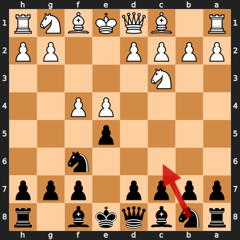
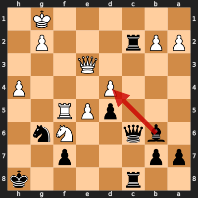
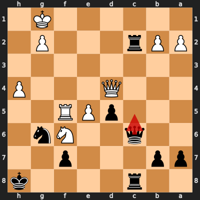
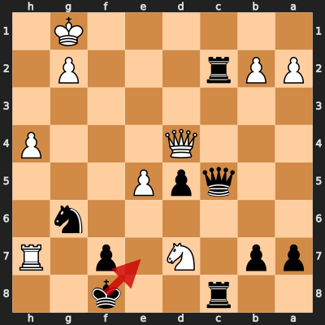
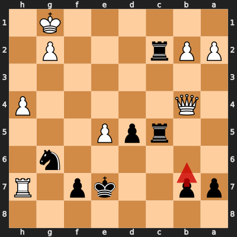
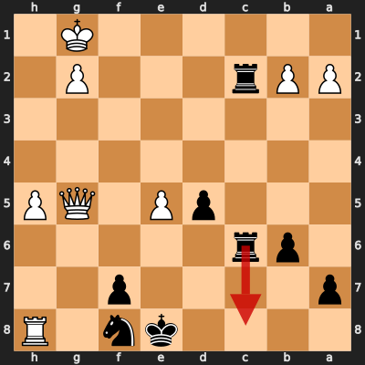

# Game 4: pallab87 vs diegoami

| | |
|---|---|
| Date | 2024.09.22 |
| Result | 1-0 |
| White | pallab87 (1840) |
| Black | diegoami (1594) |
| Opening | C28 |
| Time control | 1/86400 |
| Termination | pallab87 won by resignation |
| Source | [Chess.com](https://www.chess.com/game/daily/706412459) |

[Download PGN](4/4.pgn)

## Opening theory

**Opening moves**: 1. e4 e5 2. Nc3 Nf6 3. f4


Matches a cataloged line (*Vienna Game: Vienna Gambit*, ECO C29) through 3. f4. diegoami played 3... Nc6, the first move not found in any named line in this dataset.

**Known continuations from here:**

- 3... d5 (*Vienna Game: Vienna Gambit, Main Line*, C29)

## Blunders by diegoami

### Move 3... Nc6 (Mistake)

**Moves from the start of the game**: 1. e4 e5 2. Nc3 Nf6 3. f4

**Better was:** 3... d5 4. fxe5 =

**Best continuation:** 4. fxe5 Nxe5 5. d4 Ng6 6. e5 Ng8 7. Nf3 Bb4 ±



### Move 30... Bxd4 (Mistake)

**Moves since the previous diagram**: 3... Nc6 4. fxe5 Nxe5 5. d4 Ng6 6. e5 Ng8 7. Nf3 Bb4 8. Bc4 d5 9. Bb3 N8e7 10. O-O O-O 11. Ne2 c6 12. c3 Ba5 13. Bc2 Bg4 14. Ng3 Qd7 15. Qd3 Bc7 16. h4 h5 17. Nh2 c5 18. Bg5 cxd4 19. cxd4 Bb6 20. Nxg4 Qxg4 21. Rf4 Qd7 22. Nxh5 Rac8 23. Bh6 Rxc2 24. Bxg7 Qc6 25. Raf1 Nxf4 26. Nxf4 Kxg7 27. Nh5+ Kh8 28. Nf6 Ng6 29. Rf5 Rc8 30. Qe3

**Better was:** 30... Rxg2+ 31. Kxg2 Nxh4+ 32. Kh2 Nxf5 33. Qh3+ Kg7 34. Qg4+ -+

**Best continuation:** 31. Qxd4 Qc4 32. Rh5+ Kg7 33. Qe3 Kf8 34. Qg5 Rc1+ -+



### Move 31... Qc5 (Blunder)

**Moves since the previous diagram**: 30... Bxd4 31. Qxd4

**Better was:** 31... Qc4 32. Rh5+ Kg7 33. Qe3 Kf8 34. Qf3 Qd4+ 35. Kh1 -+

**Best continuation:** 32. Rh5+ ±



### Move 34... Ke7 (Blunder)

**Moves since the previous diagram**: 31... Qc5 32. Rh5+ Kg7 33. Rh7+ Kf8 34. Nd7+

**Better was:** 34... Kg8 35. Nxc5 ±

**Best continuation:** 35. Nxc5 R2xc5 36. e6 Kxe6 37. Qg4+ Kd6 38. Rxf7 Ne5 +-



### Move 36... b6 (Mistake)

**Moves since the previous diagram**: 34... Ke7 35. Nxc5 R8xc5 36. Qb4

**Better was:** 36... Nxe5 37. Qd4 Ke6 38. Rh6+ f6 39. Qf4 Nd7 40. Qg4+ +-

**Best continuation:** 37. Qg4 Nxe5 38. Qg5+ Ke6 39. Rh6+ Ng6 40. h5 d4 +-



### Move 40... Rc8 (Blunder)

**Moves since the previous diagram**: 36... b6 37. Qg4 Rc6 38. h5 Nf8 39. Qg5+ Ke8 40. Rh8

**Better was:** 40... Rxb2 41. Qg8 Ke7 42. Qxf8+ Ke6 43. Qe8+ Kf5 44. Qxf7+ +-

**Best continuation:** 41. Qh6 Rc1+ 42. Kh2 Rd8 43. Qxf8+ Kd7 44. Qd6+ Kc8 +-



## Full PGN

<details>
<summary>Show movetext</summary>

```pgn
[Event "Let\\'s Play!"]
[Site "Chess.com"]
[Date "2024.09.22"]
[Round "?"]
[White "pallab87"]
[Black "diegoami"]
[Result "1-0"]
[TimeControl "1/86400"]
[WhiteElo "1840"]
[BlackElo "1594"]
[Termination "pallab87 won by resignation"]
[ECO "C28"]
[EndDate "2024.10.18"]
[Link "https://www.chess.com/game/daily/706412459"]

1. e4 { +0.11 } 1... e5 { +0.24 } 2. Nc3 { +0.02 } 2... Nf6 { +0.04 } 3. f4
{ -0.14 } 3... Nc6 $2 { +1.67 } ( 3... d5 4. fxe5 $10 ) 4. fxe5 { +1.51 } ( 4.
fxe5 Nxe5 5. d4 Ng6 6. e5 Ng8 7. Nf3 Bb4 $16 ) 4... Nxe5 { +1.36 } 5. d4
{ +1.35 } 5... Ng6 { +1.33 } 6. e5 { +1.35 } 6... Ng8 { +1.35 } 7. Nf3
{ +1.33 } 7... Bb4 { +1.41 } 8. Bc4 { +1.19 } 8... d5 { +1.31 } 9. Bb3
{ +0.86 } 9... N8e7 { +0.79 } 10. O-O { +0.86 } 10... O-O { +0.96 } 11. Ne2
{ +0.92 } 11... c6 { +1.23 } 12. c3 { +1.13 } 12... Ba5 { +1.13 } 13. Bc2
{ +0.99 } 13... Bg4 { +1.41 } 14. Ng3 { +1.03 } 14... Qd7 $6 { +1.58 } ( 14...
Bb6 15. Kh1 Qd7 16. h3 Bxh3 17. Nh2 Be6 18. Bg5 $16 ) 15. Qd3 $6 { +1.02 } (
15. h3 Bxh3 $16 ) ( 15. h3 Bxh3 $16 ) 15... Bc7 { +1.03 } ( 15... c5 16. Be3
$16 ) 16. h4 $6 { +0.40 } ( 16. Nh4 c5 $16 ) 16... h5 $6 { +1.30 } ( 16... f6
$14 ) ( 16... f6 $14 ) 17. Nh2 { +1.53 } ( 17. Nh2 $16 ) 17... c5 { +1.89 } 18.
Bg5 { +2.17 } 18... cxd4 { +2.54 } 19. cxd4 { +2.68 } 19... Bb6 { +2.45 } 20.
Nxg4 $6 { +1.89 } ( 20. Bxe7 Qxe7 $16 ) 20... Qxg4 { +2.00 } ( 20... Qxg4 21.
Rf4 Qe6 22. Bxe7 Qxe7 23. Kh1 Rac8 24. Nf5 $16 ) 21. Rf4 { +1.85 } 21... Qd7
{ +1.85 } 22. Nxh5 $2 { +0.53 } ( 22. Re1 Rae8 $16 ) 22... Rac8 { +0.58 } (
22... Rac8 23. Bb1 Rc1+ 24. Kh2 Rxb1 25. Rxb1 Nxf4 26. Nxf4 $14 ) 23. Bh6 $2
{ -1.99 } ( 23. Bb1 Rc1+ $14 ) 23... Rxc2 { -1.87 } ( 23... Rxc2 24. Bxg7 Rc6
25. Raf1 Nxf4 26. Rxf4 Ng6 27. Qg3 $17 ) 24. Bxg7 { -2.10 } 24... Qc6 $6
{ -1.39 } ( 24... Rc6 25. Rf3 Qg4 26. Nf6+ Rxf6 27. Bxf6 Bxd4+ 28. Kh1 $17 )
25. Raf1 $2 { -3.05 } ( 25. Rg4 Qc4 $17 ) ( 25. Rg4 Qc4 $17 ) 25... Nxf4
{ -3.40 } ( 25... Nxf4 26. Rxf4 Qg6 27. Qxg6 Nxg6 28. Rg4 Rfc8 29. Bf6 $19 )
26. Nxf4 { -3.72 } 26... Kxg7 { -4.74 } 27. Nh5+ { -4.55 } 27... Kh8 { -4.71 }
28. Nf6 { -4.82 } 28... Ng6 $6 { -4.19 } ( 28... Bxd4+ 29. Qxd4 Qb6 30. Qxb6
axb6 31. Rf3 Rfc8 32. Rg3 $19 ) 29. Rf5 { -4.23 } ( 29. Kh2 Bxd4 $19 ) 29...
Rc8 { -4.48 } 30. Qe3 $2 { -6.19 } ( 30. Rh5+ Kg7 31. Kh1 Rh8 32. Rxh8 Kxh8 33.
h5 Rxb2 $19 ) 30... Bxd4 $2 { -4.33 } ( 30... Rxg2+ 31. Kxg2 Nxh4+ 32. Kh2 Nxf5
33. Qh3+ Kg7 34. Qg4+ $19 ) ( 30... Rxg2+ 31. Kxg2 Nxh4+ 32. Kh2 Nxf5 33. Qh3+
Kg7 34. Qg4+ $19 ) 31. Qxd4 { -4.41 } ( 31. Qxd4 Qc4 32. Rh5+ Kg7 33. Qe3 Kf8
34. Qg5 Rc1+ $19 ) 31... Qc5 $4 { +1.33 } ( 31... Qc4 32. Rh5+ Kg7 33. Qe3 Kf8
34. Qf3 Qd4+ 35. Kh1 $19 ) 32. Rh5+ { +1.77 } ( 32. Rh5+ $16 ) 32... Kg7
{ +1.90 } 33. Rh7+ { +1.79 } 33... Kf8 { +1.66 } 34. Nd7+ { +1.71 } 34... Ke7
$4 { +5.92 } ( 34... Kg8 35. Nxc5 $16 ) 35. Nxc5 { +5.71 } ( 35. Nxc5 R2xc5 36.
e6 Kxe6 37. Qg4+ Kd6 38. Rxf7 Ne5 $18 ) 35... R8xc5 { +6.19 } 36. Qb4 $2
{ +3.91 } ( 36. Qe3 Ke6 37. Qh3+ Kxe5 38. Rxf7 Rxg2+ 39. Qxg2 Rc1+ $18 ) 36...
b6 $2 { +5.78 } ( 36... Nxe5 37. Qd4 Ke6 38. Rh6+ f6 39. Qf4 Nd7 40. Qg4+ $18 )
( 36... Nxe5 37. Qd4 Ke6 38. Rh6+ f6 39. Qf4 Nd7 40. Qg4+ $18 ) 37. Qg4
{ +5.95 } ( 37. Qg4 Nxe5 38. Qg5+ Ke6 39. Rh6+ Ng6 40. h5 d4 $18 ) 37... Rc6 $6
{ +6.89 } ( 37... Nxe5 38. Qg5+ Ke6 39. Rh6+ Ng6 40. h5 d4 41. Qg4+ $18 ) 38.
h5 $6 { +6.04 } ( 38. Qf5 Nxe5 39. Qxe5+ Re6 40. Qxd5 Rd2 41. Qxd2 Re4 $18 ) (
38. Qf5 Nxe5 39. Qxe5+ Re6 40. Qxd5 Rd2 41. Qxd2 Re4 $18 ) 38... Nf8 $6
{ +6.89 } ( 38... Ke8 39. e6 Rxe6 40. Qa4+ Kf8 41. Qxc2 Kg8 42. Qf5 $18 ) (
38... Ke8 39. e6 Rxe6 40. Qa4+ Kf8 41. Qxc2 Kg8 42. Qf5 $18 ) 39. Qg5+
{ +6.84 } ( 39. Qg5+ Ke8 40. Qg8 Rc7 41. Rh8 Kd7 42. Qxf8 Kc6 $18 ) 39... Ke8
{ +6.83 } 40. Rh8 { +6.73 } 40... Rc8 $4 { +999.89 } ( 40... Rxb2 41. Qg8 Ke7
42. Qxf8+ Ke6 43. Qe8+ Kf5 44. Qxf7+ $18 ) 41. Qh6 { +999.92 } ( 41. Qh6 Rc1+
42. Kh2 Rd8 43. Qxf8+ Kd7 44. Qd6+ Kc8 $18 ) 1-0
```
</details>
