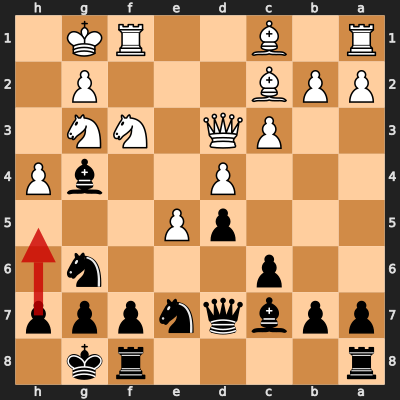

# Game 4: pallab87 vs diegoami

| | |
|---|---|
| Date | 2024.09.22 |
| Result | 1-0 |
| White | pallab87 (1840) |
| Black | diegoami (1594) |
| Opening | C28 |
| Time control | 1/86400 |
| Termination | pallab87 won by resignation |
| Source | [Chess.com](https://www.chess.com/game/daily/706412459) |

[Download PGN](4/4.pgn)

## Opening theory

**Opening moves**: 1. e4 e5 2. Nc3 Nf6 3. f4


Matches a cataloged line (*Vienna Game: Vienna Gambit*, ECO C29) through 3. f4. diegoami played 3... Nc6, the first move not found in any named line in this dataset.

**Known continuations from here:**

- 3... d5 (*Vienna Game: Vienna Gambit, Main Line*, C29)

## Blunders by diegoami

<details>
<summary>Move 3... Nc6 (Inaccuracy)</summary>

**Moves from the start of the game**: 1. e4 e5 2. Nc3 Nf6 3. f4

**Better was:** 3... d5 =

**Best continuation:** 4. fxe5 Nxe5 ±


</details>

<details>
<summary>Move 16... h5 (Inaccuracy)</summary>

**Moves since the previous diagram**: 3... Nc6 4. fxe5 Nxe5 5. d4 Ng6 6. e5 Ng8 7. Nf3 Bb4 8. Bc4 d5 9. Bb3 N8e7 10. O-O O-O 11. Ne2 c6 12. c3 Ba5 13. Bc2 Bg4 14. Ng3 Qd7 15. Qd3 Bc7 16. h4

**Better was:** 16... f6 =

**Best continuation:** 17. Nh2 ±



</details>

### Move 31... Qc5 (Blunder)

**Moves since the previous diagram**: 16... h5 17. Nh2 c5 18. Bg5 cxd4 19. cxd4 Bb6 20. Nxg4 Qxg4 21. Rf4 Qd7 22. Nxh5 Rac8 23. Bh6 Rxc2 24. Bxg7 Qc6 25. Raf1 Nxf4 26. Nxf4 Kxg7 27. Nh5+ Kh8 28. Nf6 Ng6 29. Rf5 Rc8 30. Qe3 Bxd4 31. Qxd4

**Better was:** 31... Qc4 32. Rh5+ Kg7 33. Qe3 Kf8 34. b3 Rc1+ 35. Kh2 -+

**Best continuation:** 32. Rh5+ Kg7 ±


### Move 34... Ke7 (Mistake)

**Moves since the previous diagram**: 31... Qc5 32. Rh5+ Kg7 33. Rh7+ Kf8 34. Nd7+

**Better was:** 34... Kg8 35. Nxc5 ±

**Best continuation:** 35. Nxc5 R2xc5 36. e6 Kxe6 37. Qg4+ Kd6 38. Rxf7 Ne5 +-


## Full PGN

<details>
<summary>Show movetext</summary>

```pgn
[Event "Let\\'s Play!"]
[Site "Chess.com"]
[Date "2024.09.22"]
[Round "?"]
[White "pallab87"]
[Black "diegoami"]
[Result "1-0"]
[TimeControl "1/86400"]
[WhiteElo "1840"]
[BlackElo "1594"]
[Termination "pallab87 won by resignation"]
[ECO "C28"]
[EndDate "2024.10.18"]
[Link "https://www.chess.com/game/daily/706412459"]

1. e4 { +0.35 } 1... e5 { +0.29 } 2. Nc3 { +0.23 } 2... Nf6 { +0.22 } 3. f4
{ -0.23 } 3... Nc6 $6 { +1.59 } ( 3... d5 $10 ) 4. fxe5 { +1.36 } ( 4. fxe5
Nxe5 $16 ) 4... Nxe5 { +1.43 } 5. d4 { +1.37 } 5... Ng6 { +1.37 } 6. e5
{ +1.31 } 6... Ng8 { +1.33 } 7. Nf3 { +1.39 } 7... Bb4 { +1.43 } 8. Bc4
{ +1.18 } 8... d5 { +1.20 } 9. Bb3 { +0.81 } 9... N8e7 { +0.83 } 10. O-O
{ +0.79 } 10... O-O { +0.97 } 11. Ne2 { +0.85 } 11... c6 { +1.09 } 12. c3
{ +1.09 } 12... Ba5 { +1.20 } 13. Bc2 { +1.13 } 13... Bg4 { +1.36 } 14. Ng3
{ +0.95 } 14... Qd7 { +1.56 } 15. Qd3 { +0.93 } 15... Bc7 { +1.02 } 16. h4
{ +0.13 } 16... h5 $6 { +1.41 } ( 16... f6 $10 ) 17. Nh2 { +1.32 } ( 17. Nh2
$16 ) 17... c5 { +1.69 } 18. Bg5 { +2.27 } 18... cxd4 { +2.40 } 19. cxd4
{ +2.68 } 19... Bb6 { +2.47 } 20. Nxg4 { +1.62 } 20... Qxg4 { +1.77 } 21. Rf4
{ +1.88 } 21... Qd7 { +2.52 } 22. Nxh5 $6 { +0.42 } ( 22. Re1 Qe6 23. Nxh5 Nc6
24. Nxg7 Kxg7 25. Bf6+ Kg8 $16 ) 22... Rac8 { +0.78 } ( 22... Rac8 $14 ) 23.
Bh6 $2 { -1.77 } ( 23. Bb1 Rc1+ 24. Kh2 Rxb1 25. Rxb1 Nxf4 26. Nxf4 f6 $14 )
23... Rxc2 { -1.93 } ( 23... Rxc2 $17 ) 24. Bxg7 { -1.76 } 24... Qc6 { -1.22 }
25. Raf1 $6 { -2.91 } ( 25. Rg4 Qc4 $17 ) 25... Nxf4 { -3.10 } ( 25... Nxf4 26.
Rxf4 $17 ) 26. Nxf4 { -4.67 } 26... Kxg7 { -4.60 } 27. Nh5+ { -4.69 } 27... Kh8
{ -4.62 } 28. Nf6 { -4.80 } 28... Ng6 { -4.05 } 29. Rf5 { -4.39 } 29... Rc8
{ -4.36 } 30. Qe3 { -6.10 } 30... Bxd4 { -4.21 } 31. Qxd4 { -4.35 } 31... Qc5
$4 { +1.63 } ( 31... Qc4 32. Rh5+ Kg7 33. Qe3 Kf8 34. b3 Rc1+ 35. Kh2 $19 ) 32.
Rh5+ { +1.87 } ( 32. Rh5+ Kg7 $16 ) 32... Kg7 { +1.74 } 33. Rh7+ { +1.52 }
33... Kf8 { +1.61 } 34. Nd7+ { +1.80 } 34... Ke7 $2 { +5.46 } ( 34... Kg8 35.
Nxc5 $16 ) 35. Nxc5 { +5.51 } ( 35. Nxc5 R2xc5 36. e6 Kxe6 37. Qg4+ Kd6 38.
Rxf7 Ne5 $18 ) 35... R8xc5 { +6.01 } 36. Qb4 { +4.01 } 36... b6 { +5.63 } 37.
Qg4 { +5.89 } 37... Rc6 { +6.77 } 38. h5 { +6.12 } 38... Nf8 { +6.55 } 39. Qg5+
{ +6.70 } 39... Ke8 { +6.87 } 40. Rh8 { +6.84 } 40... Rc8 { +999.88 } 41. Qh6
{ +999.92 } 1-0
```
</details>
