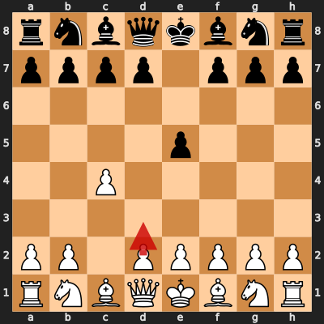
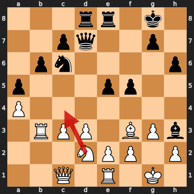
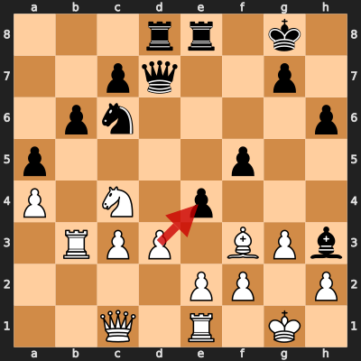

# Game 5: diegoami vs paandroid

| | |
|---|---|
| Date | 2024.08.25 |
| Result | 0-1 |
| White | diegoami (1570) |
| Black | paandroid (1584) |
| Opening | A20 |
| Time control | 1/86400 |
| Termination | paandroid won by resignation |
| Source | [Chess.com](https://www.chess.com/game/daily/695105555?move=0) |

[Download PGN](5/5.pgn)

## Opening theory

**Opening moves**: 1. c4 e5



Matches a cataloged line (*English Opening: King's English Variation*, ECO A20) through 1... e5. diegoami played 2. d3, the first move not found in any named line in this dataset.

**Known continuations from here:**

- 2. Nc3 (*English Opening: King's English Variation, Reversed Sicilian*, A21)
- 2. Nf3 (*English Opening: King's English Variation, Nimzowitsch Variation*, A20)
- 2. g3 h5 (*English Opening: Drill Variation*, A20)

## Blunders by diegoami

<details>
<summary>Move 20. Nc4 (Inaccuracy)</summary>

**Moves from the start of the game**: 1. c4 e5 2. d3 Nf6 3. Nc3 Nc6 4. Nf3 d5 5. cxd5 Nxd5 6. g3 Nxc3 7. bxc3 Be7 8. Bg2 O-O 9. O-O Be6 10. a4 a5 11. Ba3 Bxa3 12. Rxa3 Qd7 13. Re1 Rad8 14. Ng5 Bf5 15. Rb3 b6 16. Qc1 h6 17. Ne4 Bh3 18. Bf3 f5 19. Nd2 Rfe8

**Better was:** 20. Rb2 Kh8 =+

**Best continuation:** 20... e4 ∓



</details>

<details>
<summary>Move 21. dxe4 (Inaccuracy)</summary>

**Moves since the previous diagram**: 20. Nc4 e4

**Better was:** 21. Bh5 ∓

**Best continuation:** 21... Qf7 22. exf5 Qxc4 23. Rb5 Na7 24. Rb2 Bxf5 25. Rd2 -+



</details>

<details>
<summary>Move 22. Bh1 (Inaccuracy)</summary>

**Moves since the previous diagram**: 21. dxe4 fxe4

**Better was:** 22. Bh5 ∓

**Best continuation:** 22... Qe6 23. Nxa5 Nxa5 24. Rb4 Nc4 25. Bg2 Bxg2 26. Kxg2 -+


</details>

## Full PGN

<details>
<summary>Show movetext</summary>

```pgn
[Event "Let\\'s Play!"]
[Site "Chess.com"]
[Date "2024.08.25"]
[Round "?"]
[White "diegoami"]
[Black "paandroid"]
[Result "0-1"]
[TimeControl "1/86400"]
[WhiteElo "1570"]
[BlackElo "1584"]
[Termination "paandroid won by resignation"]
[ECO "A20"]
[EndDate "2024.09.25"]
[Link "https://www.chess.com/game/daily/695105555?move=0"]

1. c4 { +0.14 } 1... e5 { +0.12 } 2. d3 { +0.05 } 2... Nf6 { +0.08 } 3. Nc3
{ +0.10 } 3... Nc6 { +0.05 } 4. Nf3 { +0.10 } 4... d5 { +0.13 } 5. cxd5
{ +0.09 } 5... Nxd5 { +0.14 } 6. g3 { +0.05 } 6... Nxc3 { +0.35 } 7. bxc3
{ +0.42 } 7... Be7 { +0.26 } 8. Bg2 { +0.22 } 8... O-O { +0.23 } 9. O-O
{ +0.25 } 9... Be6 { +0.31 } 10. a4 { +0.24 } 10... a5 { +0.36 } 11. Ba3
{ +0.02 } 11... Bxa3 { +0.02 } 12. Rxa3 { +0.02 } 12... Qd7 { +0.25 } 13. Re1
{ +0.00 } 13... Rad8 { +0.02 } 14. Ng5 { -0.04 } 14... Bf5 { -0.12 } 15. Rb3
{ -0.14 } 15... b6 { -0.18 } 16. Qc1 { -0.33 } 16... h6 { -0.37 } 17. Ne4
{ -0.28 } 17... Bh3 { -0.26 } 18. Bf3 { -1.10 } 18... f5 { -1.19 } 19. Nd2
{ -1.10 } 19... Rfe8 { -0.59 } 20. Nc4 $6 { -2.31 } ( 20. Rb2 Kh8 $15 ) 20...
e4 { -2.24 } ( 20... e4 $17 ) 21. dxe4 $6 { -4.10 } ( 21. Bh5 $17 ) 21... fxe4
{ -2.84 } ( 21... Qf7 22. exf5 Qxc4 23. Rb5 Na7 24. Rb2 Bxf5 25. Rd2 $19 ) 22.
Bh1 $6 { -4.92 } ( 22. Bh5 $17 ) 22... Qf7 { -5.01 } ( 22... Qe6 23. Nxa5 Nxa5
24. Rb4 Nc4 25. Bg2 Bxg2 26. Kxg2 $19 ) 23. Rd1 { -5.76 } 23... Qxc4 { -5.53 }
0-1
```
</details>
