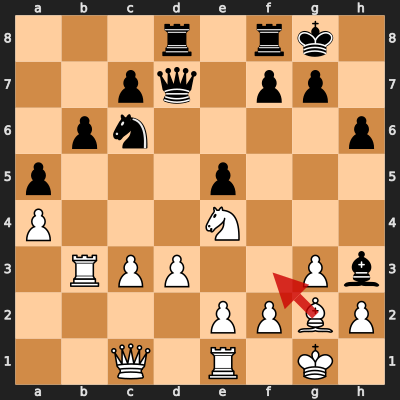
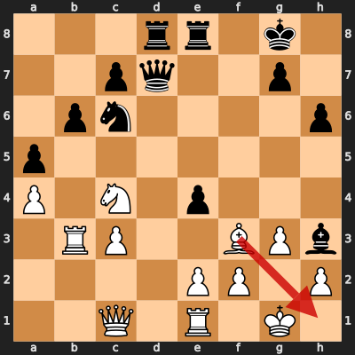

# Game 5: diegoami vs paandroid

| | |
|---|---|
| Date | 2024.08.25 |
| Result | 0-1 |
| White | diegoami (1570) |
| Black | paandroid (1584) |
| Opening | A20 |
| Time control | 1/86400 |
| Termination | paandroid won by resignation |
| Source | [Chess.com](https://www.chess.com/game/daily/695105555?move=0) |

[Download PGN](5/5.pgn)

## Opening theory

**Opening moves**: 1. c4 e5


Matches a cataloged line (*English Opening: King's English Variation*, ECO A20) through 1... e5. diegoami played 2. d3, the first move not found in any named line in this dataset.

**Known continuations from here:**

- 2. Nc3 (*English Opening: King's English Variation, Reversed Sicilian*, A21)
- 2. Nf3 (*English Opening: King's English Variation, Nimzowitsch Variation*, A20)
- 2. g3 h5 (*English Opening: Drill Variation*, A20)

## Blunders by diegoami

### Move 18. Bf3 (Mistake)

**Moves from the start of the game**: 1. c4 e5 2. d3 Nf6 3. Nc3 Nc6 4. Nf3 d5 5. cxd5 Nxd5 6. g3 Nxc3 7. bxc3 Be7 8. Bg2 O-O 9. O-O Be6 10. a4 a5 11. Ba3 Bxa3 12. Rxa3 Qd7 13. Re1 Rad8 14. Ng5 Bf5 15. Rb3 b6 16. Qc1 h6 17. Ne4 Bh3

**Better was:** 18. Bxh3 Qxh3 19. f3 Qe6 20. Rb5 f5 21. Nd2 e4 =

**Best continuation:** 18... f5 19. Nd2 e4 20. Bh1 exd3 21. exd3 Qxd3 22. Bxc6 ∓



### Move 20. Nc4 (Mistake)

**Moves since the previous diagram**: 18. Bf3 f5 19. Nd2 Rfe8

**Better was:** 20. Rb2 Nb8 =+

**Best continuation:** 20... e4 21. Bh5 ∓


### Move 21. dxe4 (Mistake)

**Moves since the previous diagram**: 20. Nc4 e4

**Better was:** 21. Bh5 ∓

**Best continuation:** 21... Qf7 22. exf5 Qxc4 23. Rb5 Na7 24. Rb2 Bxf5 25. Rd1 -+


### Move 22. Bh1 (Mistake)

**Moves since the previous diagram**: 21. dxe4 fxe4

**Better was:** 22. Bh5 Rf8 23. Rb5 Qe6 24. Ne3 Na7 25. Rb1 g6 ∓

**Best continuation:** 22... Qe6 23. Nxa5 Nxa5 24. Rb5 Nc4 25. a5 Nxa5 26. Rb4 -+



## Full PGN

<details>
<summary>Show movetext</summary>

```pgn
[Event "Let\\'s Play!"]
[Site "Chess.com"]
[Date "2024.08.25"]
[Round "?"]
[White "diegoami"]
[Black "paandroid"]
[Result "0-1"]
[TimeControl "1/86400"]
[WhiteElo "1570"]
[BlackElo "1584"]
[Termination "paandroid won by resignation"]
[ECO "A20"]
[EndDate "2024.09.25"]
[Link "https://www.chess.com/game/daily/695105555?move=0"]

1. c4 { +0.00 } 1... e5 { +0.14 } 2. d3 { -0.09 } 2... Nf6 { -0.02 } 3. Nc3 { -0.10 } 3... Nc6 { -0.04 } 4. Nf3 { +0.00 } 4... d5 { -0.02 } 5. cxd5 { +0.05 } 5... Nxd5 { +0.11 } 6. g3 { +0.04 } 6... Nxc3 { +0.35 } 7. bxc3 { +0.20 } 7... Be7 { +0.26 } 8. Bg2 { +0.21 } 8... O-O { +0.23 } 9. O-O { +0.24 } 9... Be6 { +0.27 } 10. a4 { +0.28 } 10... a5 { +0.35 } 11. Ba3 { +0.00 } 11... Bxa3 { +0.03 } 12. Rxa3 { +0.00 } 12... Qd7 { +0.14 } 13. Re1 { +0.06 } 13... Rad8 { +0.00 } 14. Ng5 { -0.08 } 14... Bf5 { +0.00 } 15. Rb3 { -0.17 } 15... b6 { -0.17 } 16. Qc1 { -0.34 } 16... h6 { -0.35 } 17. Ne4 { -0.34 } 17... Bh3 { -0.12 } 18. Bf3 $2 { -1.30 } ( 18. Bxh3 Qxh3 19. f3 Qe6 20. Rb5 f5 21. Nd2 e4 $10 ) 18... f5 { -1.47 } ( 18... f5 19. Nd2 e4 20. Bh1 exd3 21. exd3 Qxd3 22. Bxc6 $17 ) 19. Nd2 { -1.37 } 19... Rfe8 $6 { -0.68 } ( 19... e4 20. Bh1 exd3 21. exd3 Qxd3 22. Bxc6 Qxd2 23. Qxd2 $17 ) 20. Nc4 $2 { -1.98 } ( 20. Rb2 Nb8 $15 ) ( 20. Rb2 Nb8 $15 ) 20... e4 { -2.14 } ( 20... e4 21. Bh5 $17 ) 21. dxe4 $2 { -4.16 } ( 21. Bh5 $17 ) 21... fxe4 $2 { -2.47 } ( 21... Qf7 22. exf5 Qxc4 23. Rb5 Na7 24. Rb2 Bxf5 25. Rd1 $19 ) ( 21... Qf7 22. exf5 Qxc4 23. Rb5 Na7 24. Rb2 Bxf5 25. Rd1 $19 ) 22. Bh1 $2 { -5.10 } ( 22. Bh5 Rf8 23. Rb5 Qe6 24. Ne3 Na7 25. Rb1 g6 $17 ) ( 22. Bh5 Rf8 23. Rb5 Qe6 24. Ne3 Na7 25. Rb1 g6 $17 ) 22... Qf7 { -5.00 } ( 22... Qe6 23. Nxa5 Nxa5 24. Rb5 Nc4 25. a5 Nxa5 26. Rb4 $19 ) 23. Rd1 $6 { -5.94 } ( 23. Nxa5 Nxa5 24. Rb4 Rf8 25. Qf4 Qxf4 26. gxf4 Rxf4 $19 ) 23... Qxc4 { -5.64 } ( 23... Rf8 24. f4 Qxc4 25. Rxd8 Rxd8 26. Rb2 Qd5 27. Qe1 $19 ) 0-1
```
</details>
