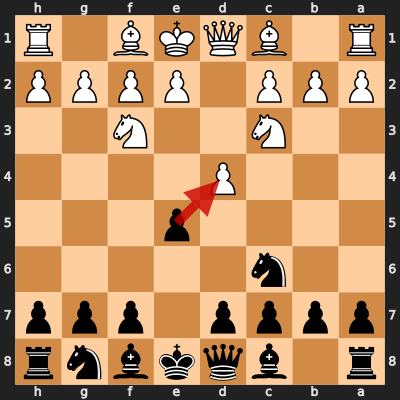
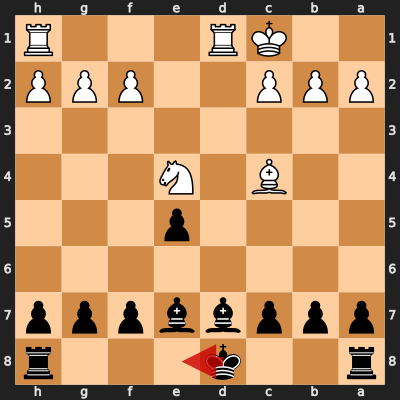
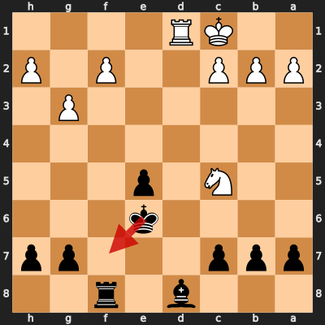
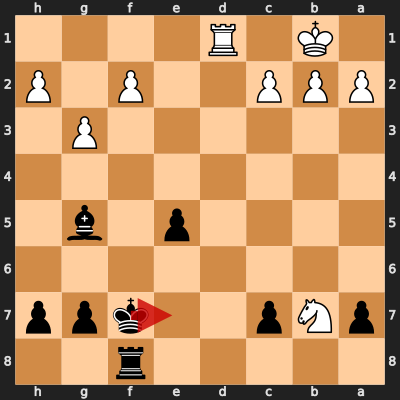
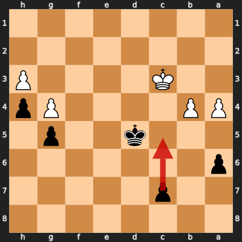
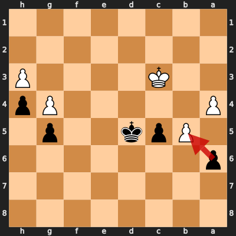

# Game 6: TonedCabbage vs diegoami

| | |
|---|---|
| Date | 2024.08.12 |
| Result | 1-0 |
| White | TonedCabbage (1588) |
| Black | diegoami (1584) |
| Opening | A00 |
| Time control | 1/86400 |
| Termination | TonedCabbage won by resignation |
| Source | [Chess.com](https://www.chess.com/game/daily/689519115) |

[Download PGN](6/6.pgn)

## Opening theory

**Opening moves**: 1. Nc3 e5 2. Nf3 Nc6 3. d4



Matches a cataloged line (*Van Geet Opening: Napoleon Attack*, ECO A00) through 3. d4. diegoami played 3... exd4, the first move not found in any named line in this dataset.

## Blunders by diegoami

<details>
<summary>Move 13... Ke8 (Inaccuracy)</summary>

**Moves from the start of the game**: 1. Nc3 e5 2. Nf3 Nc6 3. d4 exd4 4. Nxd4 Nxd4 5. Qxd4 Nf6 6. e4 d6 7. e5 dxe5 8. Qxd8+ Kxd8 9. Bg5 Be7 10. Bxf6 Bxf6 11. O-O-O+ Bd7 12. Ne4 Be7 13. Bc4

**Better was:** 13... Rf8 14. Rd5 =+

**Best continuation:** 14. Bxf7+ Kxf7 15. Rxd7 Rac8 16. Rd3 Rhd8 17. Rb3 b6 +=



</details>

<details>
<summary>Move 20... Kf7 (Inaccuracy)</summary>

**Moves since the previous diagram**: 13... Ke8 14. Bxf7+ Kxf7 15. Rxd7 Rac8 16. g3 Ke6 17. Rd3 Rhf8 18. Rhd1 Rcd8 19. Rxd8 Bxd8 20. Nc5+

**Better was:** 20... Kf5 21. Nd7 Rg8 22. Rd5 Ke6 23. c4 c6 24. Nc5+ =

**Best continuation:** 21. Rd7+ Kf6 ±



</details>

<details>
<summary>Move 22... Ke7 (Inaccuracy)</summary>

**Moves since the previous diagram**: 20... Kf7 21. Nxb7 Bg5+ 22. Kb1

**Better was:** 22... Kg6 23. h4 Be7 24. Rd2 Rf3 25. Kc1 e4 26. Re2 =

**Best continuation:** 23. Nc5 h5 24. Ne4 Bh6 25. Rd3 g5 26. Kc1 g4+ ±



</details>

### Move 39... c5 (Blunder)

**Moves since the previous diagram**: 22... Ke7 23. Nc5 Rxf2 24. Ne4 Rf5 25. Nxg5 Rxg5 26. c4 Rf5 27. c5 e4 28. c6 e3 29. Kc2 Rc5+ 30. Kd3 Rxc6 31. Kxe3 Rc2 32. Rd2 Rxd2 33. Kxd2 Kd6 34. Kd3 Kd5 35. b4 g5 36. h3 h5 37. g4 h4 38. a4 a6 39. Kc3

**Better was:** 39... Ke5 40. Kc4 Kf4 41. a5 c6 42. Kc5 Kg3 43. Kxc6 =

**Best continuation:** 40. b5 a5 41. Kd3 c4+ 42. Ke3 c3 43. Kd3 Ke5 +-



<details>
<summary>Move 40... axb5 (Inaccuracy)</summary>

**Moves since the previous diagram**: 39... c5 40. b5

**Best continuation:** 41. axb5 c4 42. b6 Ke4 43. Kxc4 Kf3 44. Kd5 Kg2 +-



</details>

## Full PGN

<details>
<summary>Show movetext</summary>

```pgn
[Event "Let\\'s Play!"]
[Site "Chess.com"]
[Date "2024.08.12"]
[Round "?"]
[White "TonedCabbage"]
[Black "diegoami"]
[Result "1-0"]
[TimeControl "1/86400"]
[WhiteElo "1588"]
[BlackElo "1584"]
[Termination "TonedCabbage won by resignation"]
[ECO "A00"]
[EndDate "2024.09.29"]
[Link "https://www.chess.com/game/daily/689519115"]

1. Nc3 { -0.02 } 1... e5 { +0.13 } 2. Nf3 { +0.35 } 2... Nc6 { +0.15 } 3. d4
{ +0.12 } 3... exd4 { +0.07 } 4. Nxd4 { +0.14 } 4... Nxd4 { +0.75 } 5. Qxd4
{ +0.85 } 5... Nf6 { +1.04 } 6. e4 { +1.11 } 6... d6 { +1.03 } 7. e5 { +0.12 }
7... dxe5 { +0.06 } 8. Qxd8+ { -0.64 } 8... Kxd8 { -0.67 } 9. Bg5 { -0.72 }
9... Be7 { -0.33 } 10. Bxf6 { -0.90 } 10... Bxf6 { -0.34 } 11. O-O-O+ { -0.27 }
11... Bd7 { -0.60 } 12. Ne4 { -1.27 } 12... Be7 { -0.46 } 13. Bc4 { -0.63 }
13... Ke8 $6 { +0.70 } ( 13... Rf8 14. Rd5 $15 ) 14. Bxf7+ { +0.60 } ( 14.
Bxf7+ Kxf7 15. Rxd7 Rac8 16. Rd3 Rhd8 17. Rb3 b6 $14 ) 14... Kxf7 { +0.61 } 15.
Rxd7 { +0.61 } 15... Rac8 { +0.69 } 16. g3 { +0.25 } 16... Ke6 { +0.46 } 17.
Rd3 { +0.54 } 17... Rhf8 { +0.48 } 18. Rhd1 { +0.32 } 18... Rcd8 { +0.28 } 19.
Rxd8 { +0.24 } 19... Bxd8 { +0.26 } 20. Nc5+ { +0.02 } 20... Kf7 $6 { +1.62 } (
20... Kf5 21. Nd7 Rg8 22. Rd5 Ke6 23. c4 c6 24. Nc5+ $10 ) 21. Nxb7 $6
{ +0.03 } ( 21. Rd7+ Kf6 $16 ) ( 21. Rd7+ Kf6 $16 ) 21... Bg5+ { +0.10 } (
21... Bg5+ 22. Kb1 $10 ) 22. Kb1 { +0.05 } 22... Ke7 $6 { +1.98 } ( 22... Kg6
23. h4 Be7 24. Rd2 Rf3 25. Kc1 e4 26. Re2 $10 ) 23. Nc5 { +1.98 } ( 23. Nc5 h5
24. Ne4 Bh6 25. Rd3 g5 26. Kc1 g4+ $16 ) 23... Rxf2 { +1.92 } 24. Ne4 { +2.07 }
24... Rf5 { +3.12 } 25. Nxg5 $2 { +0.02 } ( 25. g4 Rf4 26. Nxg5 Kf6 27. Nh3
Rxg4 28. Rd2 g5 $18 ) 25... Rxg5 { -0.03 } ( 25... Rxg5 26. b4 Ke6 27. Kb2 e4
28. Rd8 Rh5 29. Re8+ $10 ) 26. c4 { -0.03 } 26... Rf5 { +0.04 } 27. c5
{ -0.58 } 27... e4 { -0.03 } 28. c6 { -0.30 } 28... e3 { -0.03 } 29. Kc2
{ -0.79 } 29... Rc5+ { -0.15 } 30. Kd3 { -0.07 } 30... Rxc6 { -0.07 } 31. Kxe3
{ -0.07 } 31... Rc2 { -0.06 } 32. Rd2 { -0.04 } 32... Rxd2 { +0.00 } 33. Kxd2
{ +0.00 } 33... Kd6 { +0.01 } 34. Kd3 { +0.00 } 34... Kd5 { +0.00 } 35. b4
{ +0.00 } 35... g5 { +0.00 } 36. h3 { +0.00 } 36... h5 { +0.00 } 37. g4
{ +0.00 } 37... h4 { +0.00 } 38. a4 { -0.46 } 38... a6 { +0.00 } 39. Kc3
{ +0.00 } 39... c5 $4 { +4.80 } ( 39... Ke5 40. Kc4 Kf4 41. a5 c6 42. Kc5 Kg3
43. Kxc6 $10 ) 40. b5 { +5.43 } ( 40. b5 a5 41. Kd3 c4+ 42. Ke3 c3 43. Kd3 Ke5
$18 ) 40... axb5 $6 { +35.71 } 41. axb5 { +35.70 } ( 41. axb5 c4 42. b6 Ke4 43.
Kxc4 Kf3 44. Kd5 Kg2 $18 ) 41... c4 { +42.57 } 42. b6 { +80.23 } 42... Kc6
{ +999.73 } 43. Kxc4 { +999.78 } 43... Kxb6 { +999.78 } 44. Kd5 { +999.80 }
44... Kc7 { +999.80 } 45. Ke6 { +999.81 } 45... Kd8 { +999.82 } 46. Kf6
{ +999.83 } 46... Ke8 { +999.83 } 47. Kxg5 { +999.84 } 47... Kf7 { +999.84 }
48. Kxh4 { +999.85 } 48... Kg6 { +999.85 } 49. g5 { +999.86 } 49... Kg7
{ +999.87 } 50. Kh5 { +999.87 } 50... Kh7 { +999.87 } 51. g6+ { +999.88 } 51...
Kg8 { +999.88 } 52. Kh6 { +999.88 } 52... Kh8 { +999.88 } 53. g7+ { +999.89 }
53... Kg8 { +999.89 } 54. h4 { +999.90 } 54... Kf7 { +999.90 } 55. Kh7
{ +999.91 } 1-0
```
</details>
