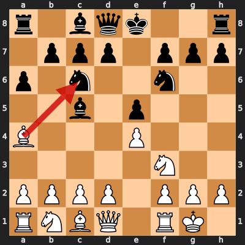
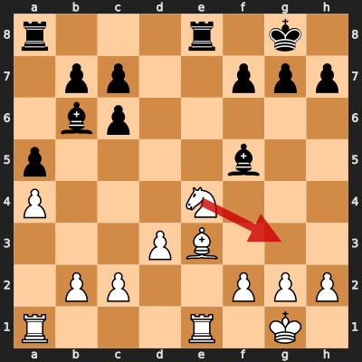
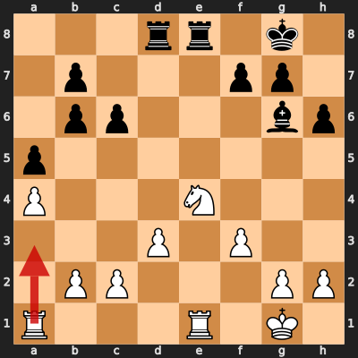

# Game 7: diegoami vs Carpevi

| | |
|---|---|
| Date | 2024.08.12 |
| Result | 0-1 |
| White | diegoami (1520) |
| Black | Carpevi (1275) |
| Opening | C77 |
| Time control | 1/86400 |
| Termination | Carpevi won by resignation |
| Source | [Chess.com](https://www.chess.com/game/daily/689597069) |

[Download PGN](7/7.pgn)

## Opening theory

**Opening moves**: 1. e4 e5 2. Nf3 Nc6 3. Bb5 a6 4. Ba4 Nf6 5. O-O Bc5



Matches a cataloged line (*Ruy Lopez: Morphy Defense, Møller Variation*, ECO C78) through 5... Bc5. diegoami played 6. Bxc6, the first move not found in any named line in this dataset.

## Blunders by diegoami

<details>
<summary>Move 18. Ng3 (Inaccuracy)</summary>

**Moves from the start of the game**: 1. e4 e5 2. Nf3 Nc6 3. Bb5 a6 4. Ba4 Nf6 5. O-O Bc5 6. Bxc6 dxc6 7. Nxe5 Nxe4 8. Qe2 Qd5 9. Nc3 Qxe5 10. Qxe4 Qxe4 11. Nxe4 Bb6 12. d3 O-O 13. Be3 Bd7 14. Nc5 Bc8 15. a4 a5 16. Rfe1 Re8 17. Ne4 Bf5

**Better was:** 18. Bxb6 cxb6 ±

**Best continuation:** 18... Bxe3 =



</details>

### Move 22. Ra3 (Blunder)

**Moves since the previous diagram**: 18. Ng3 Bg6 19. Bxb6 cxb6 20. f3 h6 21. Ne4 Rad8

**Better was:** 22. Nd2 Rxe1+ +=

**Best continuation:** 22... f5 23. Rb3 fxe4 24. fxe4 b5 25. axb5 c5 26. c4 -+



## Full PGN

<details>
<summary>Show movetext</summary>

```pgn
[Event "Let\\'s Play!"]
[Site "Chess.com"]
[Date "2024.08.12"]
[Round "?"]
[White "diegoami"]
[Black "Carpevi"]
[Result "0-1"]
[TimeControl "1/86400"]
[WhiteElo "1520"]
[BlackElo "1275"]
[Termination "Carpevi won by resignation"]
[ECO "C77"]
[EndDate "2024.08.20"]
[Link "https://www.chess.com/game/daily/689597069"]

1. e4 { +0.35 } 1... e5 { +0.38 } 2. Nf3 { +0.17 } 2... Nc6 { +0.28 } 3. Bb5
{ +0.42 } 3... a6 { +0.39 } 4. Ba4 { +0.37 } 4... Nf6 { +0.39 } 5. O-O
{ +0.32 } 5... Bc5 { +0.47 } 6. Bxc6 { +0.10 } 6... dxc6 { +0.10 } 7. Nxe5
{ +0.14 } 7... Nxe4 { +0.11 } 8. Qe2 { +0.11 } 8... Qd5 { +0.08 } 9. Nc3
{ -0.26 } 9... Qxe5 { -0.11 } 10. Qxe4 { -0.12 } 10... Qxe4 { -0.06 } 11. Nxe4
{ -0.04 } 11... Bb6 { +0.26 } 12. d3 { +0.25 } 12... O-O { +0.39 } 13. Be3
{ +0.16 } 13... Bd7 { +0.39 } 14. Nc5 { +0.11 } 14... Bc8 { +0.32 } 15. a4
{ +0.23 } 15... a5 { +0.21 } 16. Rfe1 { +0.20 } 16... Re8 { +0.17 } 17. Ne4
{ +0.21 } 17... Bf5 $6 { +1.53 } ( 17... Bxe3 18. Rxe3 $10 ) 18. Ng3 $6
{ +0.09 } ( 18. Bxb6 cxb6 $16 ) ( 18. Bxb6 cxb6 $16 ) 18... Bg6 { +0.39 } (
18... Bxe3 $10 ) 19. Bxb6 { +0.21 } 19... cxb6 { +0.19 } 20. f3 { +0.06 } 20...
h6 { +0.46 } 21. Ne4 { +0.37 } 21... Rad8 { +0.68 } 22. Ra3 $4 { -3.43 } ( 22.
Nd2 Rxe1+ $14 ) 22... f5 { -3.52 } ( 22... f5 23. Rb3 fxe4 24. fxe4 b5 25. axb5
c5 26. c4 $19 ) 0-1
```
</details>
