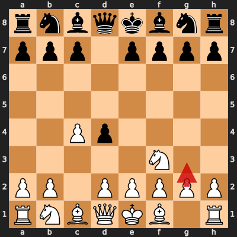
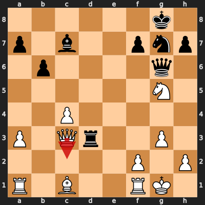
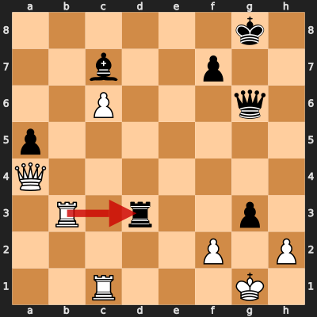

# Game 8: diegoami vs Raedhann

| | |
|---|---|
| Date | 2024.09.02 |
| Result | 1/2-1/2 |
| White | diegoami (1577) |
| Black | Raedhann (1609) |
| Opening | A09 |
| Time control | 1/86400 |
| Termination | Game drawn by agreement |
| Source | [Chess.com](https://www.chess.com/game/daily/698142949?move=0) |

[Download PGN](8/8.pgn)

## Opening theory

**Opening moves**: 1. Nf3 d5 2. c4 d4



Matches a cataloged line (*Réti Opening: Advance Variation*, ECO A09) through 2... d4. diegoami played 3. g3, the first move not found in any named line in this dataset.

**Known continuations from here:**

- 3. Rg1 (*Réti Opening: Penguin Variation*, A09)
- 3. b4 c5 (*Réti Opening: Advance Variation, Michel Gambit*, A09)
- 3. e3 c5 4. b4 (*Réti Opening: Reversed Blumenfeld Gambit*, A09)

## Blunders by diegoami

### Move 23. Qc2 (Blunder)

**Moves from the start of the game**: 1. Nf3 d5 2. c4 d4 3. g3 Nf6 4. Bg2 Nc6 5. O-O e5 6. d3 Nh5 7. a3 Bd6 8. b4 b6 9. Nbd2 g5 10. Nxg5 Qxg5 11. Bxc6+ Bd7 12. Bxa8 c6 13. Ne4 Qg6 14. b5 Bc7 15. Bxc6 Bxc6 16. bxc6 Qxc6 17. e3 Ng7 18. exd4 exd4 19. Qg4 O-O 20. Ng5 Qg6 21. Qxd4 Rd8 22. Qc3 Rxd3

**Better was:** 23. Qe1 h6 24. Nxf7 Kxf7 25. Qe2 Rc3 26. Re1 Kg8 +-

**Best continuation:** 23... Rxg3+ 24. fxg3 Qxc2 25. Nxf7 h5 26. Bf4 Kxf7 27. Bxc7+ +=



### Move 33. Rxd3 (Mistake)

**Moves since the previous diagram**: 23. Qc2 h6 24. Be3 hxg5 25. c5 b5 26. Rfc1 Ne6 27. Rab1 a6 28. a4 bxa4 29. Qxa4 a5 30. c6 Nf4 31. Bxf4 gxf4 32. Rb3 fxg3

**Better was:** 33. hxg3 Rd6 34. Re3 Qh5 35. Qa1 Kh7 36. Re8 f6 +-

**Best continuation:** 33... gxh2+ 34. Kh1 ±



## Full PGN

<details>
<summary>Show movetext</summary>

```pgn
[Event "Let\\'s Play!"]
[Site "Chess.com"]
[Date "2024.09.02"]
[Round "?"]
[White "diegoami"]
[Black "Raedhann"]
[Result "1/2-1/2"]
[TimeControl "1/86400"]
[WhiteElo "1577"]
[BlackElo "1609"]
[Termination "Game drawn by agreement"]
[ECO "A09"]
[EndDate "2024.09.22"]
[Link "https://www.chess.com/game/daily/698142949?move=0"]

1. Nf3 { +0.30 } 1... d5 { +0.34 } 2. c4 { +0.03 } 2... d4 { +0.06 } 3. g3
{ -0.10 } 3... Nf6 { +0.07 } 4. Bg2 { -0.14 } 4... Nc6 { +0.21 } 5. O-O
{ -0.15 } 5... e5 { -0.14 } 6. d3 { -0.09 } 6... Nh5 $6 { +1.10 } ( 6... Bd6 7.
e3 $10 ) 7. a3 { +0.39 } ( 7. b4 Bxb4 $16 ) 7... Bd6 { +1.45 } 8. b4 { +1.27 }
8... b6 $6 { +2.79 } ( 8... a6 9. Re1 O-O 10. Bb2 Bg4 11. Nbd2 Qd7 12. e3 $16 )
9. Nbd2 { +1.89 } ( 9. b5 Na5 10. Nxe5 Bxe5 11. Bxa8 c6 12. Nd2 Bh3 $16 ) 9...
g5 { +3.19 } 10. Nxg5 { +3.40 } 10... Qxg5 $6 { +5.72 } ( 10... Bb7 11. Ngf3
O-O 12. c5 bxc5 13. bxc5 Bxc5 14. Nxe5 $18 ) 11. Bxc6+ { +5.61 } ( 11. Bxc6+
Bd7 12. Bxa8 Nf4 13. Kh1 Nh3 14. c5 Be7 $18 ) 11... Bd7 { +5.77 } 12. Bxa8
{ +5.95 } 12... c6 { +5.91 } 13. Ne4 { +5.81 } 13... Qg6 { +5.96 } 14. b5
{ +5.55 } 14... Bc7 { +5.37 } 15. Bxc6 { +5.46 } 15... Bxc6 { +5.41 } 16. bxc6
{ +5.54 } 16... Qxc6 { +6.71 } 17. e3 { +6.72 } 17... Ng7 { +6.76 } 18. exd4
{ +6.70 } 18... exd4 { +6.98 } 19. Qg4 { +6.60 } 19... O-O { +6.65 } 20. Ng5
{ +6.27 } 20... Qg6 { +6.40 } 21. Qxd4 { +6.17 } 21... Rd8 { +6.32 } 22. Qc3
{ +5.50 } 22... Rxd3 { +5.54 } 23. Qc2 $4 { +0.47 } ( 23. Qe1 h6 24. Nxf7 Kxf7
25. Qe2 Rc3 26. Re1 Kg8 $18 ) 23... h6 $4 { +5.21 } ( 23... Rxg3+ 24. fxg3 Qxc2
25. Nxf7 h5 26. Bf4 Kxf7 27. Bxc7+ $14 ) ( 23... Rxg3+ 24. fxg3 Qxc2 25. Nxf7
h5 26. Bf4 Kxf7 27. Bxc7+ $14 ) 24. Be3 { +4.93 } ( 24. Nf3 Rxf3 25. Qxg6 fxg6
26. Bxh6 Nf5 27. Bg5 Nd4 $18 ) 24... hxg5 { +4.71 } 25. c5 { +3.84 } 25... b5
{ +4.91 } 26. Rfc1 { +4.32 } 26... Ne6 { +4.06 } 27. Rab1 { +4.43 } 27... a6
{ +4.77 } 28. a4 { +3.55 } 28... bxa4 { +4.06 } 29. Qxa4 { +3.82 } 29... a5
{ +4.40 } 30. c6 { +3.92 } 30... Nf4 { +4.06 } 31. Bxf4 { +4.42 } 31... gxf4
{ +4.42 } 32. Rb3 { +4.60 } 32... fxg3 { +4.92 } 33. Rxd3 $2 { +1.05 } ( 33.
hxg3 Rd6 34. Re3 Qh5 35. Qa1 Kh7 36. Re8 f6 $18 ) 33... gxh2+ { +1.06 } ( 33...
gxh2+ 34. Kh1 $16 ) 34. Kh1 { +1.07 } 34... Qxd3 { +1.14 } 35. Qg4+ { +1.06 }
35... Kh7 { +1.52 } 36. Qh5+ { +0.99 } 36... Kg7 { +1.22 } 1/2-1/2
```
</details>
